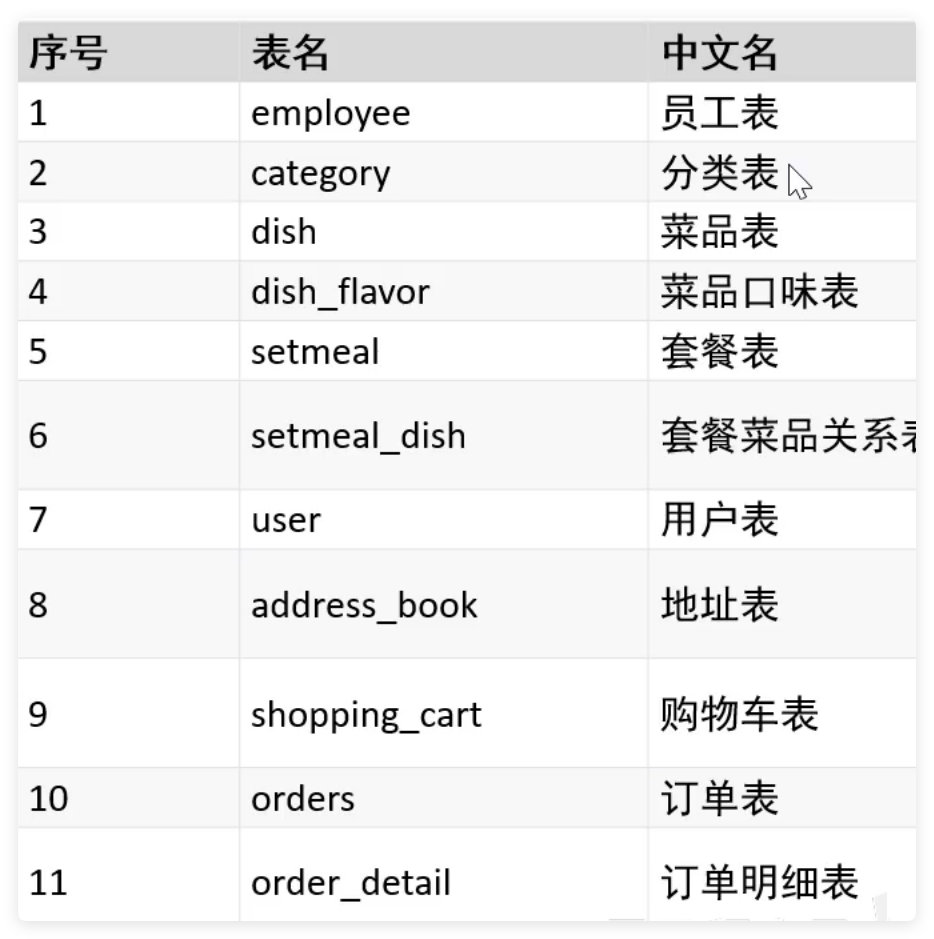

# Java苍穹外卖后端源码

#### 介绍
根据黑马程序员的Java苍穹外卖，自己写的Java苍穹外卖仓库

#### 软件架构
软件架构说明

---
Java jdk版本：1.8

Spring Boot版本：2.7.3

数据库：MySQL

开发框架：Spring + SpringMVC + SpringBoot + Nginx + MySQL  + Redis + Mybatis

开发工具：IDEA

#### 数据库设计

#### 安装教程

1.  `git clone`项目
2.  导入IDEA，并安装lombok插件
3.  配置MySQL数据库，导入sql脚本
4.  配置Redis数据库
5.  配置Nginx
6.  启动项目

#### 本地运行

1.  点运行即可
2.  访问http://localhost:8080

#### 接口文档

接口文档地址：http://localhost:8080/doc.html

#### 使用说明
* 演示图片

1.  xxxx
2.  xxxx
3.  xxxx

#### 参与贡献

1.  Fork 本仓库
2.  新建 Feat_xxx 分支
3.  提交代码
4.  新建 Pull Request

#### 赞助作者

如果觉得项目对您有帮助，请作者喝杯咖啡吧~~
